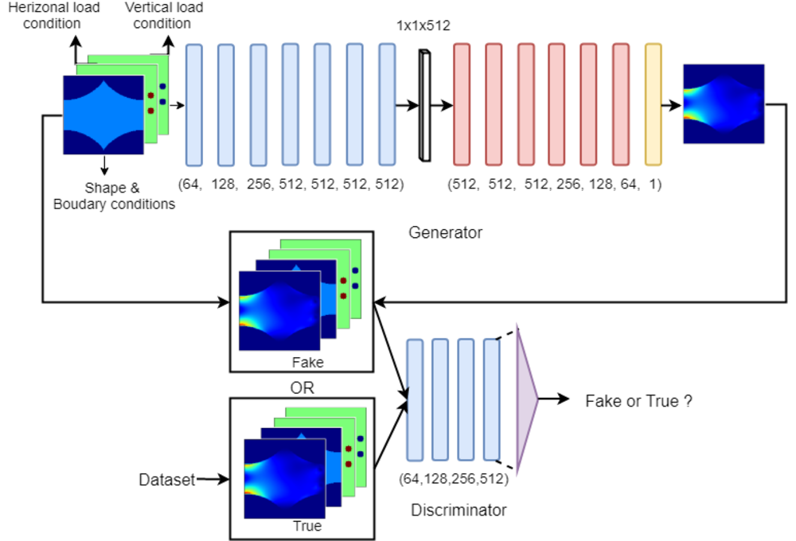
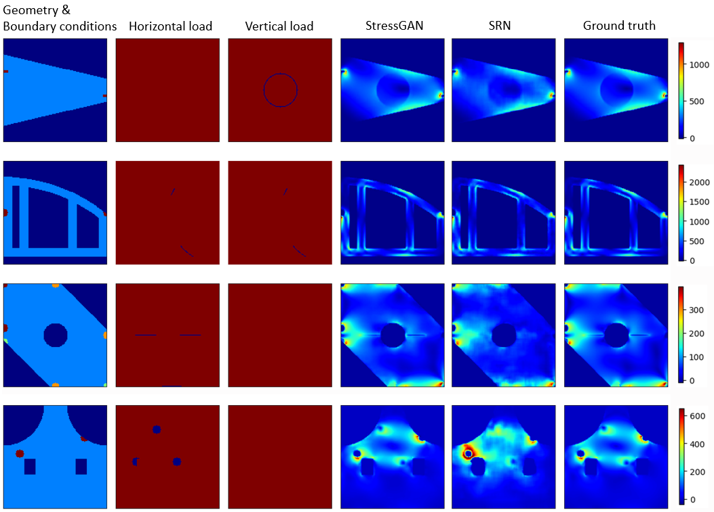

# StressGAN

## StressGAN: A Generative Deep Learning Model for 2D Stress Distribution Prediction

Code release (updating) for the paper **StressGAN: A Generative Deep Learning Model for 2D Stress Distribution Prediction**, publised in IDETC 2020, to appear in JAM 2021.

[[arXiv]](https://arxiv.org/abs/2006.11376)

## Current Citation
```
@misc{jiang2020stressgan,
      title={StressGAN: A Generative Deep Learning Model for 2D Stress Distribution Prediction}, 
      author={Haoliang Jiang and Zhenguo Nie and Roselyn Yeo and Amir Barati Farimani and Levent Burak Kara},
      year={2020},
      eprint={2006.11376},
      archivePrefix={arXiv},
      primaryClass={cs.CV}
}
```

**Authors**: [Haoliang Jiang](https://haoliangjiang.github.io), [Zhenguo Nie](https://github.com/zhenguonie) (the correspondence author), Roselyn Yeo, Amir Barati Farimani and Levent Burak Kara.


## Abstract
We propose a conditional generative adversarial network (cGAN) model called StressGAN for predicting 2D von Mises stress distributions in solid structures. The StressGAN model learns to generate stress distributions conditioned by geometries, loads, and boundary conditions through a two-player minimax game between two neural networks with no prior knowledge. By evaluating the generative network on two stress distribution datasets under multiple metrics, we demonstrate that our model can predict more accurate stress distributions than a baseline convolutional neural network model, given various and complex cases of geometries, loads, and boundary conditions.


## StressGAN



## Performance compared to the baseline



## Run the code
### Main Requirements
All the codes are tested in the following environment:
* Linux (tested on Ubuntu 16.04)
* Python 3.5
* PyTorch 1.0

### Dataset
Our dataset are composed of configuration-von Mises stress pairs with mesh size of 128x128. The configurations are represented using 3 channels in the fashion of images, following [Stress Field Prediction in Cantilevered Structures Using Convolutional Neural Networks](https://proceedings.asmedigitalcollection.asme.org/computingengineering/article-abstract/20/1/011002/955168/Stress-Field-Prediction-in-Cantilevered-Structures?redirectedFrom=fulltext).

### Training
You could run the following command to train a model from scratch
```
python train.py \
--outf=path to output folder \
--dataRootTrain=path to training dataset \
--dataRootTest=path to testing dataset \
```
or restore from previous training where the path to optimizer and path to scheduler are optional:
```
python train.py \
--outf=path to output folder \
--dataRootTrain=path to training dataset \
--dataRootTest=path to testing dataset \
--Gmodel=path to generator \
--Dmodel=path to discriminator \
--Goptim=path to optimizer of generator \
--Doptim=path to optimizer of discriminator \
--Glrschl=path to scheduler of generator \
--Doptim=path to scheduler of discriminator \
```

### Inference
To test a model, run the following command with `--eval` to test the loaded model on the testing dataset:
```
python train.py \
--outf=path to output folder \
--dataRootTrain=path to training dataset \
--dataRootTest=path to testing dataset \
--Gmodel=path to generator \
--Dmodel=path to discriminator \
--eval \
```

### Output
For each experiment, the output infomation will be saved as following:
```
├── output folder
│   ├── model
│   │   ├── models & optimizers & schdular
│   ├── summary
│   │   ├── tensorboard
│   ├── configuration.json


```
The informaton will be stored based on global steps for training.


**Note**: 
* We are still working on the repository.
* If there are any questions, please feel free to contact us.